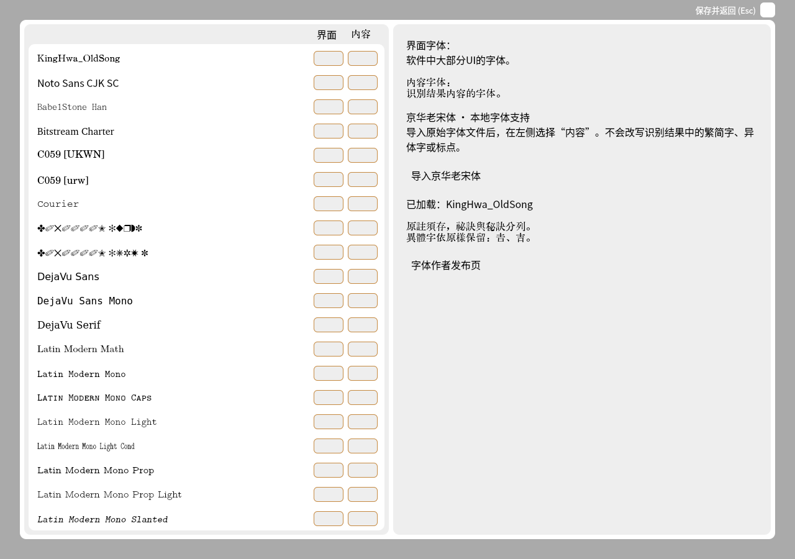

# 京华老宋体支持

入口：**全局设置 → 修改字体 → 导入京华老宋体**。选择本地原始 `.ttf`、`.otf` 或 `.ttc` 文件，加载成功后，在字体列表中选择“内容”。已安装的 `京華老宋体` / `KingHwa_OldSong` 及对应变体也会优先列出。

程序保存本地文件位置，后续启动由 Qt 加载，不联网下载字体。请保持字体文件在原位置；移动或删除后会显示加载失败，可重新选择。软件界面字体和识别结果的内容字体仍可分别选择。

选择字体只改变文字呈现，不改变 OCR 模型、识别字典、候选文字或导出文字的 Unicode 码点；PDF 的隐藏文字层仍使用原有字体逻辑。不同版本的字形设计、缺字回退或某些字显示相同，不能作为两字等同的证据。

保留用户指定的[作者发布页](https://zhuanlan.zhihu.com/p/637491623)作为来源。该页面在本次环境中返回访问限制，未完整核验最新字库的再分发条款，因此本提交提供本地加载支持，**不把字体文件重新打包进 MIT 仓库，也不修改字体或制作子集**。

本轮使用可公开取得的原字体测试副本（[文件出处](https://github.com/TerenceLiu98/Yet-Another-Lecture-Note/blob/master/KingHwa_OldSong.ttf)）验证 Qt 实际加载与字体选择。文件内元数据为 **Version 1.007; July 28, 2023**，SHA-256 为 `cd876250a229db76ebc4f6e0ad207403135aa7ce11f8c81acaa32e82eaa3c5c2`，Qt 返回家族名 `KingHwa_OldSong`。这不表示验证过作者后续版本或每个字形。测试记录见 [font-check.json](desktop/font-check.json)。

