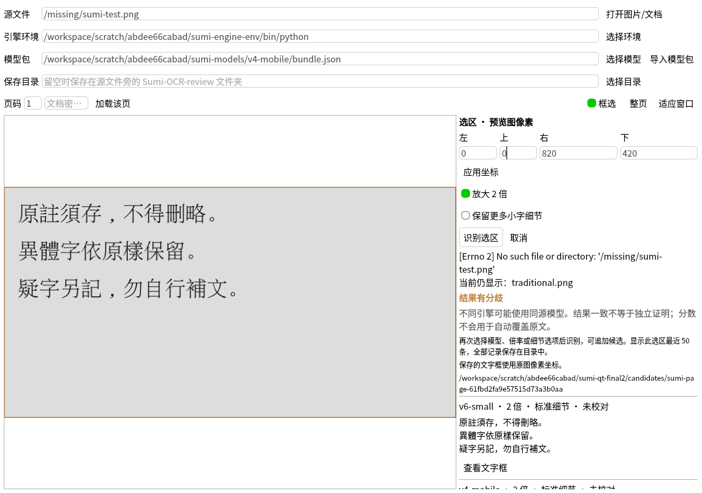
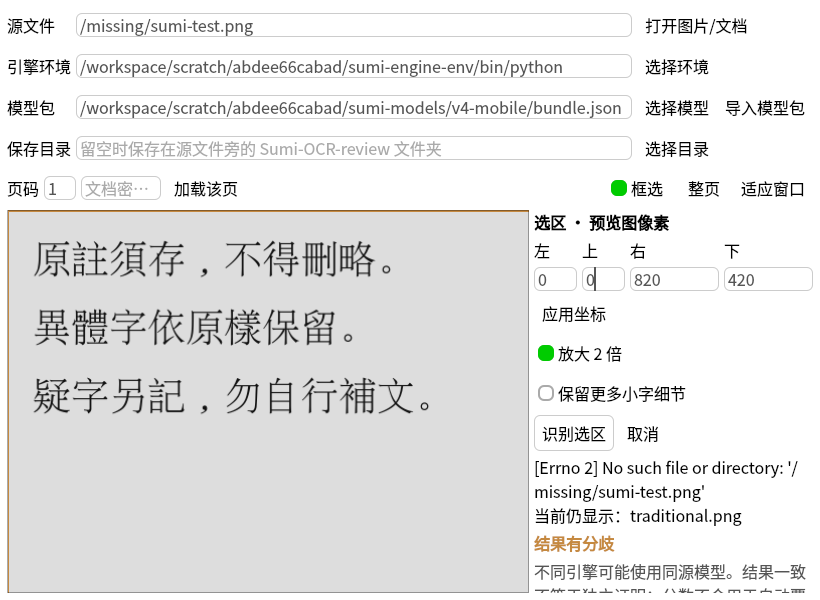
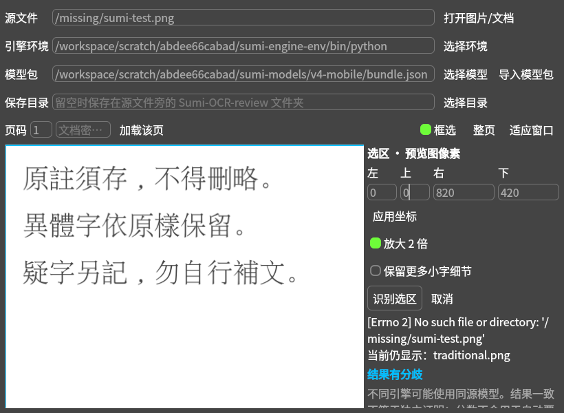

# 桌面验证

Linux 原生 PySide2 5.15.2.1 / Python 3.10.21，软件渲染。使用实际 RegionOCR QML、共享 ImageScale/控件和实际 Python 页面控制器，OCR 在独立 Python 3.12 进程运行真实模型。测试壳替代主窗口、全局配置和部分平台服务；没有据此声称完整 Windows 应用已经验收。

区域页验证了：实际鼠标拖拽与像素坐标反算、缩放后的坐标反算、越界拒绝、键盘 Tab、忙碌状态、两种真实模型候选保留与“结果有分歧”、取消活跃进程、失败打开后保留旧页及已保存候选、820×600 小窗口和浅/深色主题。字体面板验证了本地京华老宋体加载、选择内容字体、拒绝 HTTPS 字体地址。候选区和字体预览各有滚动容器。

```bash
QT_QPA_PLATFORM=offscreen QT_QUICK_BACKEND=software /path/to/qt-python dev-tools/qt_region_check.py --python /path/to/engine-python --bundle /path/to/v6/bundle.json --second-bundle /path/to/v4/bundle.json --image docs/accuracy/samples/traditional.png --output /new/qt-check
QT_QPA_PLATFORM=offscreen QT_QUICK_BACKEND=software /path/to/qt-python dev-tools/qt_font_check.py --font /path/to/KingHwa_OldSong.ttf --output /new/font-check
```

机器可读记录：[区域页](region-check.json)、[字体](font-check.json)。测试壳退出时，原有 Image_ 清理函数会报告未注册的 pixmapprovider；壳内使用本地文件显示图像，这条退出提示不等同于真实主程序的图像服务故障。

尚未验证完整程序启动、系统截图/剪贴板、原生文件选择框、Windows 打包、屏幕阅读器和新增文案的非中文翻译。静态设计审计不能代替这些实机测试。





## macOS 适配后的完整窗口检查

`dev-tools/qt_app_check.py` 在 Linux Qt 5 中加载真实 Main.qml、插件配置和页面管理器，再从标签页管理器打开区域校对。报告/画面见 `../macos/`；检查用户目录配置、字面百分号文件名和生产截图组件的 2× 坐标。pynput 热键监听替换为 dummy，offscreen 平台没有原生菜单栏/托盘；不代表 Mac Finder、权限、屏幕截图或剪贴板通过。软件渲染禁用主窗口 GPU 遮罩后检查画面非空。

```bash
QT_QPA_PLATFORM=offscreen QT_QUICK_BACKEND=software PYNPUT_BACKEND=dummy \
  /path/to/gui/python dev-tools/qt_app_check.py --output /new/check-directory
```
